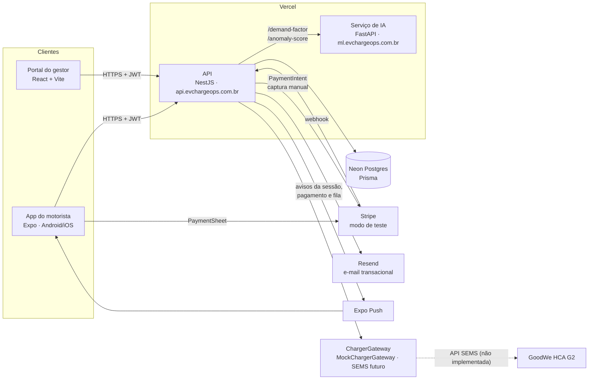
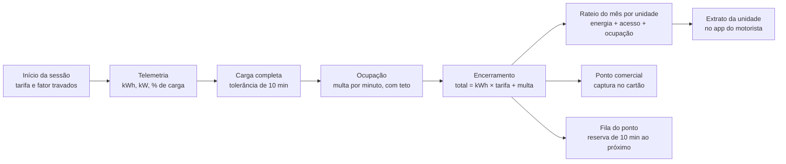

# EV ChargeOps

**Enterprise Challenge 2026 — FIAP × GoodWe · Grupo 23 · Sprint 02**

Plataforma de gestão de recarga de veículos elétricos em infraestrutura compartilhada. Ela registra cada sessão por usuário, mede o consumo, aplica uma tarifa ajustada por IA e fecha o rateio mensal por unidade do condomínio.

Este repositório é o ponto de entrada da entrega. Ele reúne a visão geral, a arquitetura, os registros de decisão (ADRs), as evidências e os links para os demais repositórios e para o ambiente de produção.

## Sumário

1. [Equipe](#1-equipe)
2. [Problema e solução](#2-problema-e-solução)
3. [Arquitetura](#3-arquitetura)
4. [Repositórios e ambientes](#4-repositórios-e-ambientes)
5. [Como os critérios da sprint são atendidos](#5-como-os-critérios-da-sprint-são-atendidos)
6. [Como testar a demonstração em produção](#6-como-testar-a-demonstração-em-produção)
7. [Como rodar localmente](#7-como-rodar-localmente)
8. [Decisões técnicas](#8-decisões-técnicas)
9. [Desvios em relação à Sprint 01](#9-desvios-em-relação-à-sprint-01)
10. [Evidências](#10-evidências)
11. [Limitações e próximos passos](#11-limitações-e-próximos-passos)

## 1. Equipe

| Integrante | RM |
|---|---|
| Carlos Eugenio Andrade | RM570285 |
| Julia Ramos | RM568988 |
| Matheus Fuchelberguer | RM571321 |
| Rodrigo Gomes Dias | RM569142 |

A autoria do código está no histórico de commits e de pull requests de cada repositório da organização [`ev-charge-ops`](https://github.com/ev-charge-ops). Toda mudança entrou por PR revisado, com CI verde.

Documentação da Sprint 01: [rodrigogmdias/ev-chargeops](https://github.com/rodrigogmdias/ev-chargeops) (pesquisa, regulação e arquitetura) e [rodrigogmdias/ev-chargeops-project](https://github.com/rodrigogmdias/ev-chargeops-project) (protótipos navegáveis).

## 2. Problema e solução

### Problema

A GoodWe opera um carregador **HCA G2** no estacionamento L1 do Energy Innovation Lab da FIAP, na Aclimação. Em condomínios, empresas e campi, um ou poucos carregadores atendem muitos motoristas. Na prática, hoje:

- não se sabe quem carregou nem quanto consumiu;
- a cobrança é opaca, normalmente rateada por igual entre todos;
- carros carregados continuam ocupando a vaga;
- o gestor não sabe quanto da demanda elétrica contratada está em uso.

A pesquisa da Sprint 01, com 10 motoristas, mostrou que 10 em 10 preferem pagar por kWh e 9 em 10 apontam a vaga ocupada como o maior problema.

### Solução

O cenário adotado é o condomínio **Residencial Aclimação**, com três pontos de recarga:

| Ponto | Tipo | Como é cobrado |
|---|---|---|
| L1-01 · Garagem L1, vaga 12 (7 kW) | `PRIVATE` | rateio mensal por unidade, kWh repassado a custo |
| L1-02 · Garagem L1, vaga 13 (7 kW) | `PRIVATE` | rateio mensal por unidade, kWh repassado a custo |
| L2-01 · Garagem L2, visitantes (22 kW) | `COMMERCIAL` | cartão via Stripe, com pré-autorização e tarifa dinâmica |

Ao redor do condomínio, o seed cria uma **rede comercial fictícia**, com 3 operadoras e 12 pontos `COMMERCIAL` (de 7 a 60 kW, a até 3,2 km), para o mapa do app mostrar recarga pública próxima. Os nomes das operadoras são inventados.

- **App do motorista** (Expo, Android e iOS, versão 1.3.0). A navegação tem quatro abas e um botão redondo de recarga:
  - **Início:** saudação com condomínio e unidade, a recarga em andamento (carga, limite, previsão de término, energia, potência e valor) e os pontos do condomínio com foto, preço e estado;
  - **Pontos:** mapa noturno em tela cheia com pins por estado, filtros (livres, potência e regime), modo lista ordenado por distância e o detalhe do ponto numa sheet clara com foto, preço, fator de demanda e regra de cobrança;
  - **Histórico:** extrato do mês da unidade (rateio, energia por dia, taxa de acesso e ocupação) e a lista de recargas, com o recibo de cada uma;
  - **Conta:** perfil, resumo do mês, alterar ou criar senha, privacidade e dados (consentimentos LGPD, exportação e pedido de exclusão) e sair;
  - **botão de recarga:** leva à sessão ao vivo quando há uma aberta, ou à aba Pontos;
  - **sino de avisos** no cabeçalho, com push e lembretes locais de conclusão, fim da tolerância e início da multa;
  - **recarga:** limite por % da bateria, kWh, R$ ou até encher; sessão ao vivo em tela noturna (carregando, tolerância e ocupação com multa); pagamento no cartão no ponto de visitantes; recibo com a curva de potência;
  - **fila:** num ponto ocupado, o motorista entra na fila e, na vez dele, o ponto fica reservado por 10 minutos.
- **Portal do gestor** (React):
  - visão geral do mês: pontos em uso ao vivo, capacidade elétrica com potência por ponto e pico do mês, indicadores com variação sobre o mês anterior e sessões de visitantes, energia por semana e anomalias para revisar;
  - sessões com filtros, score de anomalia e gaveta de detalhes com a **revisão do gestor** (confirmar ou descartar, sem mudar a cobrança);
  - rateio mensal por unidade com exportação CSV;
  - pontos e capacidade, regras de tarifa com simulação de recarga e moradores com convites.
- **API** (NestJS): concentra o domínio de sessões, preços, pagamentos, filas, avisos, consentimentos e rateio e conversa com o carregador por uma port.
- **Serviço de IA** (FastAPI + scikit-learn): dois modelos em produção, o **fator de demanda**, que entra no preço por kWh, e a **detecção de anomalias**, que pontua cada sessão encerrada para o gestor revisar.

### Identidade visual

O app e o portal seguem o design system **Pulse** ([ADR 0016](adr/0016-pulse-design-system.md)). A referência de design, com tokens, componentes, logo, movimento e uma prancheta por tela, está no [canvas do Pulse](https://claude.ai/artifact/BWq3Na6AKkLLsnc3KUbHgR).

- **Estúdio claro:** fundo cinza, cartões brancos e CTA preto. O verde fica reservado para energia; âmbar, vermelho e azul marcam atenção (tolerância, pico e fila), crítico (multa, falha e anomalia) e informação (regras e IA).
- **Superfícies noturnas** no mapa e na recarga ao vivo.
- **Tipografia** Urbanist e JetBrains Mono, e o logo "anel de carga", que também é o medidor da recarga ao vivo.
- **Movimento** em 140, 320 e 480 ms com `cubic-bezier(.16,1,.3,1)`, desligado quando o sistema pede movimento reduzido.
- **Mídia:** vídeos curtos em loop (carro em estúdio, garagem e carro visto de cima) e fotos dos pontos, com pôster para movimento reduzido.

## 3. Arquitetura

- O contrato entre os clientes e a API é o OpenAPI publicado em [`/docs-json`](https://api.evchargeops.com.br/docs-json). O app e o portal geram tipos a partir dele (`openapi-typescript` + `openapi-fetch`).
- A API é organizada em módulos com portas e adaptadores: `ChargerGateway`, `PaymentGateway`, `DemandFactorProvider`, `AnomalyScorer`, `MailSender` e `PushSender`. Cada integração externa pode ser trocada ou desligada por variável de ambiente.
- A API não tem processo em segundo plano. Sessões e filas avançam a cada leitura, e o app agenda lembretes locais a partir da linha do tempo projetada da sessão ([ADR 0017](adr/0017-push-notifications-and-projected-reminders.md)).
- O DNS fica na DigitalOcean. A raiz `evchargeops.com.br` redireciona para o portal, que também serve as fotos e os vídeos em `/media`.

## 4. Repositórios e ambientes

| Repositório | Conteúdo | Produção |
|---|---|---|
| [`ev-charge-ops/docs`](https://github.com/ev-charge-ops/docs) | este README, [ADRs](adr/) e [evidências](evidencias/) | — |
| [`ev-charge-ops/api`](https://github.com/ev-charge-ops/api) | API NestJS 12, Prisma 7, Postgres | [api.evchargeops.com.br](https://api.evchargeops.com.br) · Swagger em [/docs](https://api.evchargeops.com.br/docs) |
| [`ev-charge-ops/web`](https://github.com/ev-charge-ops/web) | portal do gestor, React 19 + Vite + TanStack Query | [app.evchargeops.com.br](https://app.evchargeops.com.br) |
| [`ev-charge-ops/mobile`](https://github.com/ev-charge-ops/mobile) | app do motorista, Expo SDK 57 + Expo Router, versão 1.3.0 | APK Android (EAS) e iOS pelo TestFlight; links no `.TXT` da entrega |
| [`ev-charge-ops/ml`](https://github.com/ev-charge-ops/ml) | modelos, notebooks e API de inferência, FastAPI + scikit-learn | [ml.evchargeops.com.br/health](https://ml.evchargeops.com.br/health) |

## 5. Como os critérios da sprint são atendidos

### 5.1 Lógica central: sessões → consumo → rateio

| Etapa | Onde está no código |
|---|---|
| Máquina de estados `AWAITING_PAYMENT → PENDING → ACTIVE → GRACE → IDLE → CLOSED / INTERRUPTED` | [`charging-session.entity.ts`](https://github.com/ev-charge-ops/api/blob/main/src/modules/charging-sessions/domain/charging-session.entity.ts) · [ADR 0010](adr/0010-charging-session-state-machine.md) |
| Início com alocação de potência pela demanda contratada | [`start-session.service.ts`](https://github.com/ev-charge-ops/api/blob/main/src/modules/charging-sessions/commands/start-session/start-session.service.ts) · [`site-capacity.ts`](https://github.com/ev-charge-ops/api/blob/main/src/modules/charge-points/site-capacity.ts) |
| Telemetria e avanço do estado até o instante atual | [`session-synchronizer.ts`](https://github.com/ev-charge-ops/api/blob/main/src/modules/charging-sessions/session-synchronizer.ts) · [`mock-charger.adapter.ts`](https://github.com/ev-charge-ops/api/blob/main/src/modules/charger-gateway/adapters/mock-charger.adapter.ts) |
| Linha do tempo projetada (fim da recarga, da tolerância e início da multa) | [`session-projector.ts`](https://github.com/ev-charge-ops/api/blob/main/src/modules/charging-sessions/session-projector.ts) · [ADR 0017](adr/0017-push-notifications-and-projected-reminders.md) |
| Custo da energia, tolerância e multa por ocupação | [`session-fees.ts`](https://github.com/ev-charge-ops/api/blob/main/src/modules/charging-sessions/domain/session-fees.ts) · [`tariff-rules.ts`](https://github.com/ev-charge-ops/api/blob/main/src/modules/charge-points/tariff-rules.ts) |
| Limite de recarga (100%, kWh, R$ ou % da bateria) | [`charging-limit.ts`](https://github.com/ev-charge-ops/api/blob/main/src/modules/charging-sessions/domain/charging-limit.ts) |
| Encerramento, pontuação de anomalia e liquidação do pagamento | [`stop-session.service.ts`](https://github.com/ev-charge-ops/api/blob/main/src/modules/charging-sessions/commands/stop-session/stop-session.service.ts) |
| Fila do ponto e reserva de 10 min | [`queue-rules.ts`](https://github.com/ev-charge-ops/api/blob/main/src/modules/charge-points/queue/queue-rules.ts) · [ADR 0019](adr/0019-charge-point-queue.md) |
| Rateio mensal por unidade | [`monthly-statement.ts`](https://github.com/ev-charge-ops/api/blob/main/src/modules/cost-sharing/domain/monthly-statement.ts) · [ADR 0013](adr/0013-monthly-cost-sharing.md) |
| Extrato da unidade para o motorista (`GET /me/statements/{month}`), com o mesmo cálculo do rateio | [`unit-statement.ts`](https://github.com/ev-charge-ops/api/blob/main/src/modules/cost-sharing/domain/unit-statement.ts) |
| Exportação CSV | [`statement-csv.ts`](https://github.com/ev-charge-ops/api/blob/main/src/modules/cost-sharing/domain/statement-csv.ts) |
| Visão geral: capacidade elétrica, pico do mês, potência ao vivo por ponto, mês anterior e visitantes | [`demand-profile.ts`](https://github.com/ev-charge-ops/api/blob/main/src/modules/cost-sharing/domain/demand-profile.ts) · [`overview-metrics.ts`](https://github.com/ev-charge-ops/api/blob/main/src/modules/cost-sharing/domain/overview-metrics.ts) |
| Pré-autorização e captura no Stripe (ponto comercial) | [`session-payments.ts`](https://github.com/ev-charge-ops/api/blob/main/src/modules/charging-sessions/session-payments.ts) · [ADR 0014](adr/0014-stripe-preauthorization.md) |
| Telas do motorista | [`mobile/src/features`](https://github.com/ev-charge-ops/mobile/tree/main/src/features) (`home`, `charging`, `notifications`, `account` e `privacy`) |
| Telas do gestor (visão geral, sessões, rateio, pontos, tarifa e moradores) | [`web/src/app/routes`](https://github.com/ev-charge-ops/web/tree/main/src/app/routes) |

As regras de domínio têm testes unitários (`*.spec.ts`), e o fluxo completo tem testes e2e contra Postgres em [`api/test`](https://github.com/ev-charge-ops/api/tree/main/test), entre eles `charging-sessions`, `cost-sharing`, `payments`, `ml-integration`, `charge-point-queue`, `anomaly-review` e `organization-overview`.

### 5.2 IA estrutural

A IA está no caminho de duas decisões do produto, e não num relatório à parte: o preço de cada sessão e a lista de sessões que o gestor revisa antes de fechar o mês.

| | Fator de demanda | Detecção de anomalias |
|---|---|---|
| Onde atua | preço por kWh no início de cada sessão | toda sessão encerrada |
| Entradas | hora e dia da semana, ocupação do local, tamanho da fila e tipo do ponto | energia, duração, tempo ocioso, potências e hora de início |
| Modelo | `GradientBoostingRegressor`: prevê a demanda das próximas 3 h e converte em fator entre 0,8 e 1,5 | `IsolationForest`, um por tipo de ponto, com score de 0 a 1 e limiar 0,5 |
| Resultado no teste | R² 0,774 contra 0,671 da persistência (MAE 0,093 e RMSE 0,176) | F1 0,72, ROC-AUC 0,97 e 2,1% de falsos positivos; 309 de 309 sessões reais acima de 72 h sinalizadas |
| Efeito | ponto comercial: `tarifa base × fator`; ponto privado: fator só informativo, sem margem na energia | a sessão sinalizada entra na fila de revisão do portal |
| Decisão humana | o gestor define a tarifa base; o fator fica travado na sessão e aparece no app e no recibo | o gestor **confirma** ou **descarta** cada sinalização, com observação. A cobrança e o rateio não mudam ([ADR 0020](adr/0020-manager-anomaly-review.md)) |
| Se o `ml` falhar | **fallback por regras** (pico das 18 h às 21 h, ocupação ≥ 80% ou fila = 1,5; madrugada com ocupação < 50% = 0,8; senão 1,0). A sessão registra a origem (`MODEL` ou `RULE`) | a sessão fecha normalmente, **sem score**, e o erro é registrado no log. Não há regra substituta em produção |
| Código na API | [`ml-demand-factor.provider.ts`](https://github.com/ev-charge-ops/api/blob/main/src/modules/intelligence/demand-factor/ml-demand-factor.provider.ts) · [`rule-demand-factor.provider.ts`](https://github.com/ev-charge-ops/api/blob/main/src/modules/intelligence/demand-factor/rule-demand-factor.provider.ts) | [`ml-anomaly-scorer.ts`](https://github.com/ev-charge-ops/api/blob/main/src/modules/intelligence/anomaly/ml-anomaly-scorer.ts) · [`session-features.ts`](https://github.com/ev-charge-ops/api/blob/main/src/modules/charging-sessions/commands/stop-session/session-features.ts) · [`anomaly-review.ts`](https://github.com/ev-charge-ops/api/blob/main/src/modules/charging-sessions/domain/anomaly-review.ts) |
| Decisão | [ADR 0011](adr/0011-pricing-with-demand-factor.md) | [ADR 0012](adr/0012-anomaly-detection.md) · [ADR 0020](adr/0020-manager-anomaly-review.md) |

- A API chama o `ml` com timeout de **1,5 s**. Sem `ML_URL`, a precificação usa as regras e as sessões ficam sem score.
- O tamanho real da fila do local entra no fator de demanda desde a [fila por ponto](adr/0019-charge-point-queue.md).
- As revisões do gestor ficam gravadas com autor, data e observação e servem como rótulos para recalibrar o limiar no futuro.
- Os modelos foram treinados com dados públicos (CC BY 4.0): recarga residencial na Noruega (Sørensen, 2024, DOI [10.5281/zenodo.13896176](https://doi.org/10.5281/zenodo.13896176)) e recarga pública em Turku, na Finlândia (Andrenacci, Bosch e Kulla, 2021, DOI [10.5281/zenodo.5721233](https://doi.org/10.5281/zenodo.5721233)).
- Detalhes no [README do `ml`](https://github.com/ev-charge-ops/ml#readme) e nos model cards de [demanda](https://github.com/ev-charge-ops/ml/blob/main/artifacts/demand_factor/v1/model-card.md) e de [anomalias](https://github.com/ev-charge-ops/ml/blob/main/artifacts/anomaly/v1/model-card.md).

### 5.3 Evidências, autoria e organização

- Evidências: seção [10](#10-evidências) e pasta [`evidencias/`](evidencias/).
- Autoria: seção [1](#1-equipe) e histórico de commits e PRs de cada repositório.
- Organização: cinco repositórios com CI, ADRs numerados em [`adr/`](adr/), referência de design no [canvas do Pulse](https://claude.ai/artifact/BWq3Na6AKkLLsnc3KUbHgR) e este README como índice.

## 6. Como testar a demonstração em produção

### Contas de demonstração

| Perfil | E-mail | Onde usar |
|---|---|---|
| Gestor (síndico) | `manager@evchargeops.dev` | portal [app.evchargeops.com.br](https://app.evchargeops.com.br) |
| Motorista (unidade B · 42) | `driver@evchargeops.dev` | app mobile |

**As senhas estão no arquivo `.TXT` da entrega** e não ficam publicadas neste repositório. Também dá para criar uma conta própria no app; ela entra como motorista sem condomínio e só enxerga os pontos comerciais.

O seed cria o condomínio **Residencial Aclimação** com 3 pontos (2 `PRIVATE` e 1 `COMMERCIAL`), 20 moradores, 184 sessões históricas dos últimos meses e 8 sessões anômalas para revisão no portal. Ele também cria a rede comercial fictícia (3 operadoras e 12 pontos, com histórico próprio) e grava as fotos dos pontos.

### Roteiro sugerido

1. **Portal, como gestor:** entre em [app.evchargeops.com.br](https://app.evchargeops.com.br). Na **Visão geral**, veja os pontos em uso, a capacidade elétrica com o pico do mês, os indicadores contra o mês anterior e as anomalias. Clique em **Revisar** numa anomalia, confirme ou descarte com uma observação e veja que o valor da sessão não muda. Abra **Sessões**, ligue "Somente anomalias" e abra a gaveta de uma sessão. Abra **Rateio mensal**, troque o mês e exporte o CSV.
2. **App, como motorista:** instale o app (link do APK Android ou convite do TestFlight no `.TXT`) e entre com a conta do motorista. Se a tela de consentimentos aparecer, aceite as finalidades obrigatórias. Em **Início**, veja o condomínio e os pontos; em **Pontos**, veja o mapa e a lista por distância.
3. **Recarga num ponto privado:** abra L1-01 ou L1-02, veja o preço e o fator de demanda informativo, toque em **Iniciar recarga**, escolha o limite (por exemplo 80%) e confirme.
4. **Simulação acelerada:** em produção, cada segundo real equivale a um minuto de recarga (`SIMULATION_SPEED`). Em poucos minutos a sessão passa por carregando, tolerância (10 min simulados) e ocupação com multa, na tela noturna. Os lembretes locais avisam a conclusão, o fim da tolerância e o início da multa. Encerre a sessão e veja o recibo.
5. **Histórico e portal:** no app, a sessão aparece no **Histórico** e no extrato do mês da unidade B · 42. No portal, ela aparece em **Sessões**, com o score de anomalia, e no **Rateio** da mesma unidade, com o mesmo valor.
6. **Ponto de visitantes:** no app, inicie uma recarga no L2-01 (`COMMERCIAL`). A tela de pagamento mostra tarifa base × fator de demanda e o valor da pré-autorização. No PaymentSheet, use o cartão de teste do Stripe **`4242 4242 4242 4242`**, com qualquer validade futura e qualquer CVC. O valor fica pré-autorizado, a recarga começa e, no encerramento, só o valor consumido é capturado.
7. **Fila (opcional, com duas contas):** com um ponto em uso por uma conta, entre na fila com outra. Ao encerrar a primeira sessão, a segunda recebe o aviso "Sua vez" e o ponto fica reservado por 10 minutos.

A API pode ser explorada pelo Swagger em [api.evchargeops.com.br/docs](https://api.evchargeops.com.br/docs).

## 7. Como rodar localmente

Requisitos: Node 24, Postgres 17, [uv](https://docs.astral.sh/uv/) (Python 3.12) e, para o app, um emulador ou aparelho com build de desenvolvimento do Expo. Cada repositório tem um `.env.example` com todas as variáveis comentadas.

| Repositório | Comandos | Observações |
|---|---|---|
| [`ml`](https://github.com/ev-charge-ops/ml#readme) | `uv sync` e `uv run --with uvicorn uvicorn ml.app:app --reload` | os modelos já estão versionados em `artifacts/`; para retreinar, veja o README |
| [`api`](https://github.com/ev-charge-ops/api) | `npm ci`, `cp .env.example .env`, `npx prisma migrate dev`, `npm run db:seed` e `npm run start:dev` | sobe em `http://localhost:3000`, com Swagger em `/docs`. Sem `ML_URL`, usa as regras; sem `STRIPE_SECRET_KEY`, o ponto comercial responde 503; com `MAIL_DRIVER=console` e `PUSH_DRIVER=console`, e-mails e pushes saem no log. O seed exige `SEED_*_PASSWORD` e usa `MEDIA_BASE_URL` para as fotos dos pontos |
| [`web`](https://github.com/ev-charge-ops/web) | `npm ci`, `cp .env.example .env` e `npm run dev` | `VITE_API_URL=http://localhost:3000`; sobe em `http://localhost:5173` |
| [`mobile`](https://github.com/ev-charge-ops/mobile#readme) | `npm ci`, `cp .env.example .env` e `npx expo start` | `EXPO_PUBLIC_API_URL` deve apontar para a API, usando o IP da máquina quando rodar no aparelho |

Testes: `npm test` (e `npm run test:e2e` na `api`) nos projetos Node e `uv run pytest` no `ml`.

## 8. Decisões técnicas

| ADR | Decisão |
|---|---|
| [0007](adr/0007-authentication.md) | autenticação: Argon2id, JWT de 15 min e refresh token opaco com rotação |
| [0008](adr/0008-authentication-flows.md) | fluxos de conta: verificação de e-mail, recuperação de senha, login por código e link, Google e Apple, organizações, convites e deep links |
| [0009](adr/0009-domain-and-email.md) | domínio próprio, DNS e e-mail transacional com Resend |
| [0010](adr/0010-charging-session-state-machine.md) | máquina de estados da sessão, carregador atrás de uma port e simulação acelerada |
| [0011](adr/0011-pricing-with-demand-factor.md) | preço por kWh com fator de demanda do modelo e fallback por regras |
| [0012](adr/0012-anomaly-detection.md) | detecção de anomalias com IsolationForest no encerramento da sessão |
| [0013](adr/0013-monthly-cost-sharing.md) | rateio mensal por unidade e exportação CSV |
| [0014](adr/0014-stripe-preauthorization.md) | pré-autorização com captura manual no Stripe para o ponto comercial |
| [0015](adr/0015-deploy-and-ci.md) | CI por repositório, Vercel, branches do Neon por preview e EAS Workflows |
| [0016](adr/0016-pulse-design-system.md) | design system Pulse: tokens, superfícies noturnas, movimento, contraste e mídia |
| [0017](adr/0017-push-notifications-and-projected-reminders.md) | avisos, push pelo Expo e lembretes locais pela linha do tempo projetada |
| [0018](adr/0018-lgpd-consent.md) | consentimento LGPD por finalidade, exportação de dados e pedido de exclusão |
| [0019](adr/0019-charge-point-queue.md) | fila nos pontos com reserva de 10 minutos |
| [0020](adr/0020-manager-anomaly-review.md) | revisão das anomalias pelo gestor, sem alterar a cobrança |

Outros pontos que valem para todo o projeto:

- **TypeScript de ponta a ponta**, com tipos gerados do OpenAPI. Uma mudança de contrato quebra o build dos clientes antes de chegar à produção.
- **Domínio sem framework:** entidades e cálculos são funções e classes puras, testadas sem banco. Os módulos da API seguem comandos e consultas separados (`commands/` e `queries/`).
- **Dinheiro em centavos e energia em Wh** no domínio, sem ponto flutuante nas somas.
- **Integrações desligáveis:** IA, Stripe, e-mail, push e carregador têm um adapter de desenvolvimento ou desabilitado, então cada repositório roda isolado.
- **Sessão estável no app:** o refresh token rotacionado aceita reuso por 60 s (`REFRESH_REUSE_GRACE_SECONDS`), e o app faz um único refresh por vez e não desloga em falhas de rede. Isso evita o logout depois de uma atualização OTA.

## 9. Desvios em relação à Sprint 01

| Sprint 01 (plano) | Sprint 02 (entregue) | Motivo |
|---|---|---|
| Integração com o HCA G2 pela API SEMS (Remote Control e telemetria) | port `ChargerGateway` com `MockChargerGateway`; o adapter SEMS responde 501 | a integração com o carregador real não entrou nesta sprint; o simulador permite demonstrar o ciclo completo, e trocar por SEMS ou OCPP é escrever um adapter ([ADR 0010](adr/0010-charging-session-state-machine.md)) |
| Telemetria em tempo real | telemetria simulada, lida sob demanda a cada consulta, com aceleração de tempo | API serverless, sem processo em segundo plano |
| Stack genérica com Redis, Docker e Railway | NestJS, React, Expo e FastAPI na Vercel, Neon e EAS | custo zero, previews por PR e nenhum servidor para manter ([ADR 0015](adr/0015-deploy-and-ci.md)) |
| Pré-autorização Stripe antes de qualquer recarga | só nos pontos `COMMERCIAL`; na rede privada, rateio mensal | não bloquear saldo de condôminos a cada recarga ([ADR 0014](adr/0014-stripe-preauthorization.md)) |
| NFS-e automática na rede comercial | não implementada | fora do escopo do MVP |
| Exportação PDF/CSV e boleto | só CSV, no formato do Excel em português; o motorista vê o extrato da unidade no app | o CSV já entra no boleto condominial pela administradora |
| Mapa com Google Maps ou Mapbox | mapa do Google no app, com pins por estado, filtros e lista por distância; o centro é fixo no condomínio de demonstração, sem pedir o GPS | a pedido do PO, a demonstração mostra o condomínio e a rede comercial fictícia ao redor; voltar ao GPS é uma configuração do app |
| Push nas etapas −15 min, conclusão e início da multa | avisos e push na conclusão, 2 min antes do fim da tolerância e no início da multa, mais pagamento, interrupção, convite e fila; sem o aviso de −15 min | sem processo em segundo plano, os lembretes da recarga são agendados no aparelho pela linha do tempo projetada ([ADR 0017](adr/0017-push-notifications-and-projected-reminders.md)) |
| Painel de capacidade com throttling lido do carregador | demanda contratada, reserva, potência ao vivo por ponto, pico do mês, pico médio diário e alerta acima de 80%; potência alocada no início da sessão | sem telemetria real de throttling |
| IA: precificação, K-Means, anomalias, previsão de custo e de capacidade | precificação (GradientBoosting) e anomalias (IsolationForest) em produção, com revisão das anomalias pelo gestor | o critério de sucesso pedia pelo menos um modelo, e entregamos dois com fallback e decisão humana registrada ([ADR 0020](adr/0020-manager-anomaly-review.md)) |
| Dataset do Kaggle (72.856 sessões) | conjuntos públicos da Noruega e de Turku no Zenodo (CC BY 4.0) | licença clara, separação residencial e pública, e tempo ocioso disponível |
| Login com e-mail e OAuth | e-mail e senha, código ou link mágico, Google e Apple, convites por deep link, edição do perfil e troca de senha | o Apple é exigido pela App Store quando há login social ([ADR 0008](adr/0008-authentication-flows.md)) |
| Protótipo numa VPS com Expo Go | builds reais (APK e TestFlight) e atualizações OTA | distribuição de verdade, sem bundle de desenvolvimento |
| Termo de consentimento LGPD no onboarding | consentimento por finalidade no primeiro acesso do app, com histórico por versão, exportação dos dados e pedido de exclusão | separar o obrigatório do opcional e atender aos direitos do titular ([ADR 0018](adr/0018-lgpd-consent.md)) |
| Fila e vaga ocupada como maior problema; fila como entrada do preço | fila por ponto com reserva de 10 minutos; o tamanho da fila entra no fator de demanda | a fila não estava detalhada no plano ([ADR 0019](adr/0019-charge-point-queue.md)) |
| Identidade visual escura com vermelho | design system Pulse, claro, com superfícies noturnas no mapa e na recarga ao vivo | o vermelho de marca competia com os alertas, e o kWh não tinha hierarquia ([ADR 0016](adr/0016-pulse-design-system.md)) |

Entraram sem estar no plano: login sem senha, convites com deep link, organizações com vários papéis, versionamento de tarifas, explicação e revisão do score de anomalia no portal, limite de recarga por % da bateria, extrato da unidade no app, fotos dos pontos e a rede comercial fictícia da demonstração.

## 10. Evidências

A pasta [`evidencias/`](evidencias/) tem a lista do que foi capturado e os arquivos.

- **Vídeo da demonstração:** _link a preencher_
- **Capturas de tela:** [`evidencias/`](evidencias/), com a lista em [`evidencias/README.md`](evidencias/README.md)
- **Referência de design:** [canvas do Pulse](https://claude.ai/artifact/BWq3Na6AKkLLsnc3KUbHgR), com uma prancheta por tela do app e do portal
- **Notebooks do `ml`**, versionados já executados, com saídas e gráficos:
  - [01 — análise exploratória](https://github.com/ev-charge-ops/ml/blob/main/notebooks/01-exploratory-analysis.ipynb)
  - [02 — fator de demanda](https://github.com/ev-charge-ops/ml/blob/main/notebooks/02-demand-factor.ipynb)
  - [03 — detecção de anomalias](https://github.com/ev-charge-ops/ml/blob/main/notebooks/03-anomaly-detection.ipynb)
- **Métricas dos modelos:** [`demand_factor/v1/metrics.json`](https://github.com/ev-charge-ops/ml/blob/main/artifacts/demand_factor/v1/metrics.json) e [`anomaly/v1/metrics.json`](https://github.com/ev-charge-ops/ml/blob/main/artifacts/anomaly/v1/metrics.json)
- **CI:** abas Actions de [api](https://github.com/ev-charge-ops/api/actions), [web](https://github.com/ev-charge-ops/web/actions), [mobile](https://github.com/ev-charge-ops/mobile/actions) e [ml](https://github.com/ev-charge-ops/ml/actions)
- **Serviços no ar:** [API](https://api.evchargeops.com.br/docs), [portal](https://app.evchargeops.com.br) e [ML](https://ml.evchargeops.com.br/health)

## 11. Limitações e próximos passos

**Limitações**

- O carregador é simulado: não há comunicação real com o HCA G2.
- Sem processo em segundo plano, sessões e filas só avançam quando alguém as consulta. Os valores continuam corretos, porque são calculados pelos horários.
- Os lembretes da recarga dependem da linha do tempo projetada pelo simulador. Com o carregador real, a projeção não existe, e os avisos voltariam a depender de uma leitura da sessão ou de um job.
- O push real depende de `PUSH_DRIVER=expo` no ambiente. Os recibos de entrega do Expo não são consultados.
- O fator de demanda considera a ocupação e a fila do local inteiro, não de cada ponto.
- Os modelos foram treinados com dados europeus e as anomalias foram avaliadas com casos sintéticos.
- A revisão de anomalias não altera valores: uma anomalia confirmada exige ajuste fora do sistema.
- A reserva da fila usa 10 minutos reais, mesmo na simulação acelerada.
- Não há como mudar o limite de uma sessão em andamento; é preciso encerrar e iniciar outra.
- As estimativas do limite por % no app usam a bateria de referência do simulador (50 kWh com 42%), porque o veículo só é conhecido depois de plugado.
- O pedido de exclusão de conta é só registrado; a exclusão é feita pela equipe.
- O mapa usa o condomínio de demonstração como centro, não a localização do aparelho.
- O rate limit fica em memória por instância serverless.
- O Stripe está em modo de teste e não há NFS-e.
- O rateio é calculado na consulta, sem fechamento congelado do mês.

**Próximos passos**

1. Adapter `SemsChargerGateway` com a API SEMS da GoodWe (CrossLogin, Remote Control e telemetria), validado no HCA G2 do laboratório.
2. Job agendado para avançar sessões e filas abertas e disparar os avisos quando o carregador real não permitir projeção.
3. Fechamento mensal congelado, PDF e integração com boleto condominial.
4. Usar as revisões do gestor como rótulos para recalibrar o limiar e treinar um modelo supervisionado, e permitir ajuste de valor a partir de uma anomalia confirmada.
5. Retreinar o fator de demanda com o histórico do condomínio, respeitando o consentimento `USAGE_ANALYTICS`, e calcular o fator por ponto.
6. NFS-e e taxa da plataforma na rede comercial.
7. Processar os pedidos de exclusão com anonimização das sessões que precisam ser mantidas.
8. Rate limit compartilhado (Redis/Upstash) e refresh token em cookie HttpOnly no portal.
